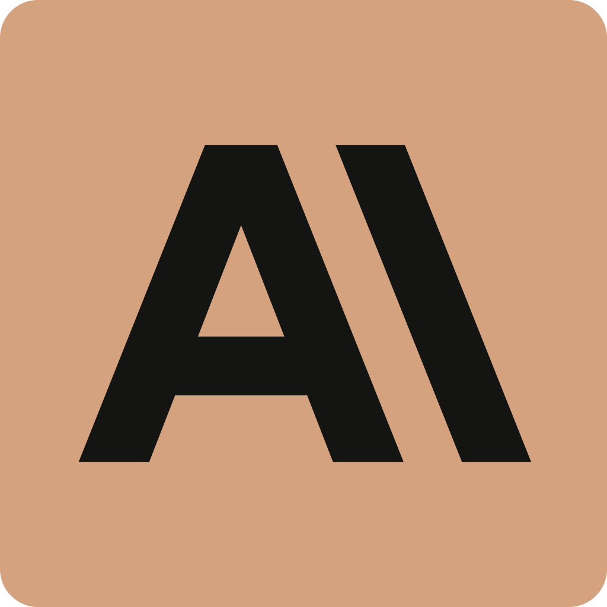
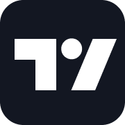
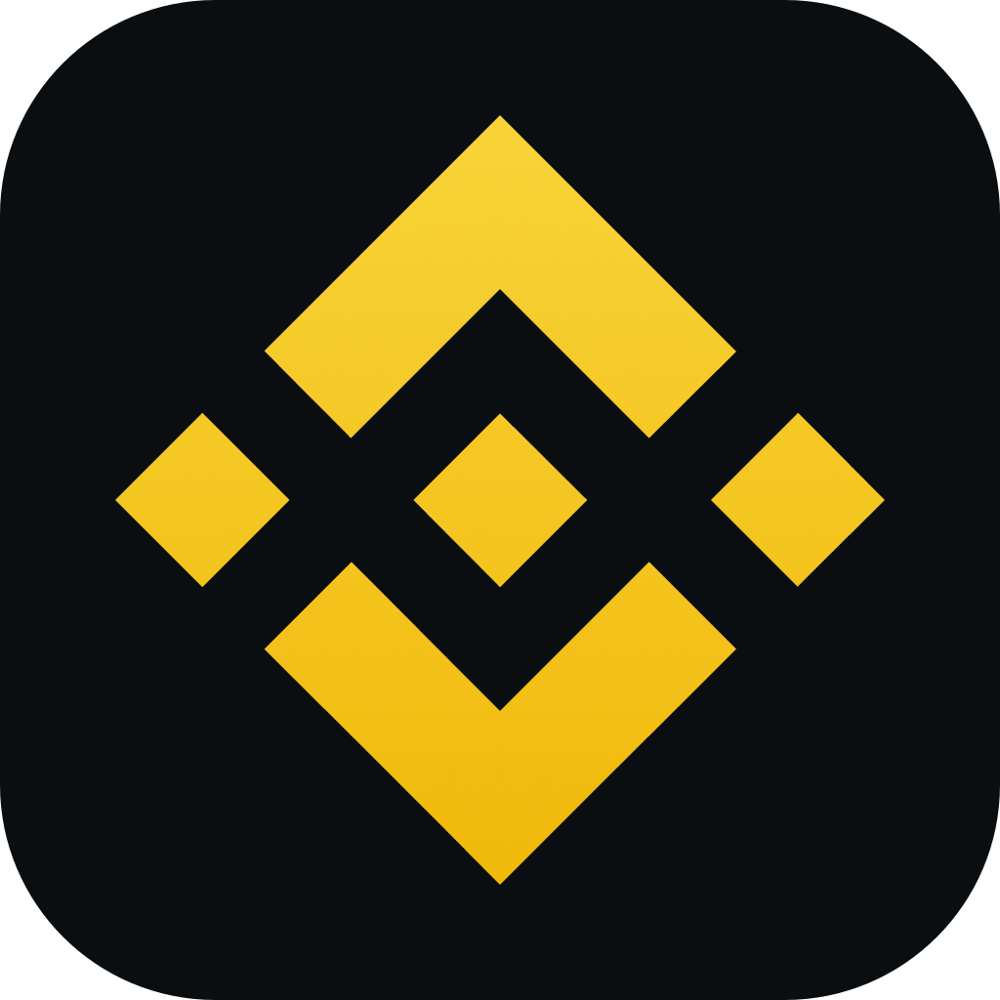
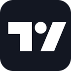
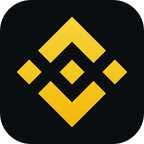

# Clash / Quantumult X icons

为 Clash Verge 和 Quantumult X 分组提供 PNG 图标的独立资源仓库，共 42 个图像文件（40 张 PNG、2 份 SVG）。

## 目录

- `icons/`：服务、国家/地区和通用代理图标。
- `sources.json`：每张图片的原始来源、尺寸、大小和 SHA-256。
- `NOTICE.md`：Qure 转载出处与品牌权利说明。

## 常用服务图标

| 用途 | 预览 | 文件 |
| --- | --- | --- |
| AI / Anthropic 高清 |  | [Anthropic-Tan-HD.png](icons/Anthropic-Tan-HD.png) |
| Google |  | [Google-G.png](icons/Google-G.png) |
| YouTube |  | [YouTube.png](icons/YouTube.png) |
| X |  | [X.png](icons/X.png) |
| Telegram |  | [Telegram.png](icons/Telegram.png) |
| 通用代理 |  | [Proxy.png](icons/Proxy.png) |
| TradingView |  | [TradingView.png](icons/TradingView.png) |
| Battle.net / 暴雪战网 |  | [BattleNet.png](icons/BattleNet.png) |
| Steam |  | [Steam.png](icons/Steam.png) |
| Binance / 加密货币 |  | [Binance-Rounded-HD.png](icons/Binance-Rounded-HD.png) |
| 所有节点 / 地球 |  | [Global.png](icons/Global.png) |

其他服务图标包括 Apple TV、Bahamut、Disney、GitHub、HBO Max、Netflix、PayPal、Spotify 和 TikTok。
同时保留 Qure 原版 AI、Google 图标作为兼容资源。

## 国家/地区与通用图标

国家/地区：`United_States.png`、`Japan.png`、`Singapore.png`、`Taiwan.png`、`Hong_Kong.png`、`Korea.png`、`EU.png`。

通用图标包括新增的地球 Global.png，以及：`Proxy.png`、`Auto.png`、`Final.png`、`Advertising.png`。

## 图片地址

使用已发布提交的 Raw URL，固定图片版本：

`https://raw.githubusercontent.com/Yoke1986/clash-icons/COMMIT/icons/YouTube.png`

图标来源与权利说明见 [NOTICE.md](NOTICE.md)，逐文件出处见 [sources.json](sources.json)。

## QX 144px 图标版本

下面四张保留品牌图案，统一为 144×144、8-bit RGBA 的标准 PNG；币安使用圆角款。
这些版本用于排查 QX 显示兼容问题；144px 不是本仓库声称的官方尺寸限制，iOS 显示仍需实际确认。

| QX 分组 | 预览 | 文件 |
| --- | --- | --- |
| AI |  | [Anthropic-Tan-QX.png](icons/Anthropic-Tan-QX.png) |
| TradingView |  | [TradingView-QX.png](icons/TradingView-QX.png) |
| 暴雪战网 |  | [BattleNet-QX.png](icons/BattleNet-QX.png) |
| 加密货币 |  | [Binance-Rounded-QX.png](icons/Binance-Rounded-QX.png) |

## QX 服务组选项配套图标

绿色 Direct.png、红色 Reject.png，以及圆角币安两套独立 PNG：QX 144×144，Clash 高清 1024×1024。旧尖角币安文件已移除。

| 用途 | 预览 | 文件 |
| --- | --- | --- |
| 直连 |  | [Direct.png](icons/Direct.png) |
| 断开 |  | [Reject.png](icons/Reject.png) |
| 加密货币 / 圆角币安 |  | [Binance-Rounded-QX.png](icons/Binance-Rounded-QX.png) |
| AI / 暖棕 Anthropic |  | [Anthropic-Tan-QX.png](icons/Anthropic-Tan-QX.png) |

### Anthropic 高清资源

- [官方原始 SVG 标志](icons/Anthropic-Symbol-Slate.svg)：原样来自 [Anthropic 官方媒体包](https://www.anthropic.com/news)。
- [暖棕底 SVG](icons/Anthropic-Tan.svg)：以官方标志路径配上自定义暖棕色底，属于本仓库的排版配色版本。
- [1024×1024 暖棕底 PNG](icons/Anthropic-Tan-HD.png)：直接由 SVG 渲染。
- [144×144 QX PNG](icons/Anthropic-Tan-QX.png)：单独从矢量源渲染，避免放大截图。

暖棕配色用于接近用户参考图；未将其称为官方原始颜色版。品牌权利和出处见 NOTICE.md 与 sources.json。

## AI / 币安两套独立规格

| 用途 | QX 144×144 | Clash 1024×1024 |
| --- | --- | --- |
| 暖色 AI | [Anthropic-Tan-QX.png](icons/Anthropic-Tan-QX.png) | [Anthropic-Tan-HD.png](icons/Anthropic-Tan-HD.png) |
| 圆角币安 | [Binance-Rounded-QX.png](icons/Binance-Rounded-QX.png) | [Binance-Rounded-HD.png](icons/Binance-Rounded-HD.png) |

币安高清版取自同一 App Store 图像的 1024px 资源，仅对外部背景加圆角；没有放大 144px QX 图标。
