# Clash / Quantumult X 图标库

全部图标由本仓库托管；按用途选 PNG，备用图标可直接取用。

## Clash 图标

| 预览 | 用途 | 文件 | 尺寸（px） | 说明 |
| --- | --- | --- | --- | --- |
|  | AI / Anthropic · 暖棕圆角 | [Anthropic-Tan-HD.png](icons/Anthropic-Tan-HD.png) | 1024 × 1024 | 1024px，矢量源直接渲染 |
| 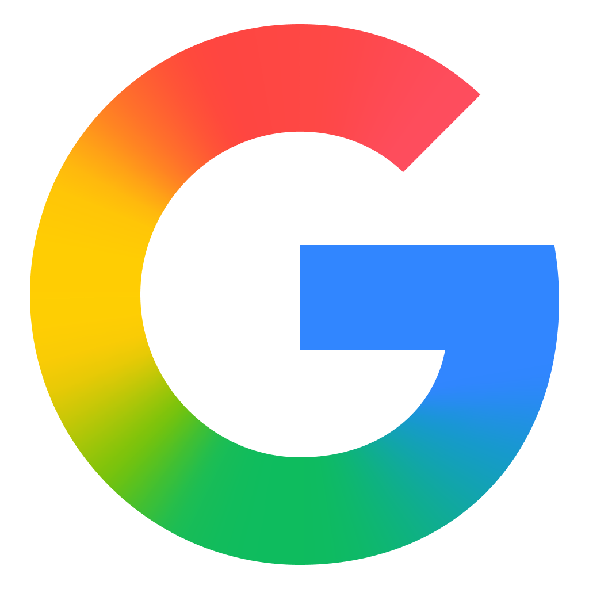 | Google · 官方渐变 G | [Google-G-HD.png](icons/Google-G-HD.png) | 1024 × 1024 | 原始高清像素，移除多余透明留白 |
|  | 加密货币 / 币安 · 圆角 | [Binance-Rounded-HD.png](icons/Binance-Rounded-HD.png) | 1024 × 1024 | 1024px 原始资源加圆角 |
| 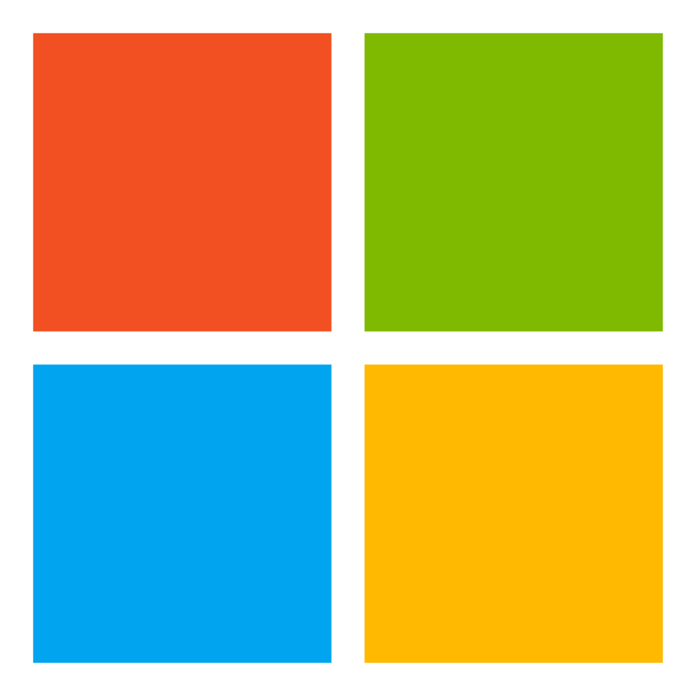 | 微软 Microsoft · 备用 | [Microsoft-HD.png](icons/Microsoft-HD.png) | 1024 × 1024 | 1024px，官方四彩标志矢量渲染 |
| 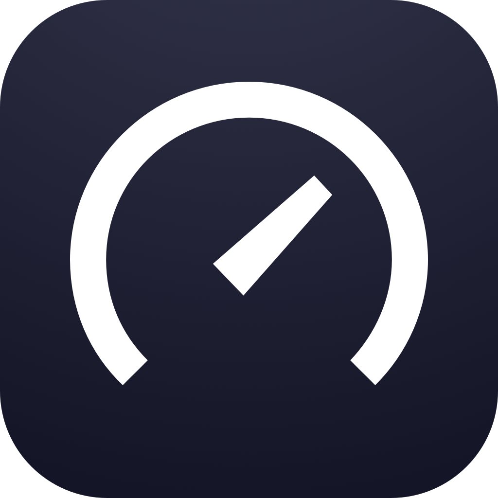 | Speedtest · 圆角 | [Speedtest-Rounded-HD.png](icons/Speedtest-Rounded-HD.png) | 1024 × 1024 | 1024px 原始图案，透明圆角与币安一致 |
|  | TradingView · 备用 | [TradingView.png](icons/TradingView.png) | 180 × 180 | 保留官方 180px 原图 |
|  | 暴雪战网 | [BattleNet.png](icons/BattleNet.png) | 196 × 196 | 保留官方 196px 原图 |

## Quantumult X 图标

| 预览 | 用途 | 文件 | 尺寸（px） |
| --- | --- | --- | --- |
|  | AI / Anthropic · 暖棕圆角 | [Anthropic-Tan-QX.png](icons/Anthropic-Tan-QX.png) | 144 × 144 |
|  | Google · 官方渐变 G | [Google-G-QX.png](icons/Google-G-QX.png) | 144 × 144 |
|  | 加密货币 / 币安 · 圆角 | [Binance-Rounded-QX.png](icons/Binance-Rounded-QX.png) | 144 × 144 |
| 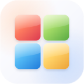 | 微软 Microsoft · 备用 | [Microsoft-QX.png](icons/Microsoft-QX.png) | 144 × 144 |
| 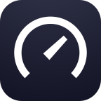 | Speedtest · 圆角 | [Speedtest-Rounded-QX.png](icons/Speedtest-Rounded-QX.png) | 144 × 144 |
|  | TradingView · 备用 | [TradingView-QX.png](icons/TradingView-QX.png) | 144 × 144 |
|  | 暴雪战网 | [BattleNet-QX.png](icons/BattleNet-QX.png) | 144 × 144 |

QX 专用版统一为 144 × 144、8-bit RGBA PNG；手机端显示以实际导入为准。

## 通用服务图标（Clash / QX 共用）

| 预览 | 服务 | 文件 | 尺寸（px） |
| --- | --- | --- | --- |
|  | Steam · 备用 | [Steam.png](icons/Steam.png) | 144 × 144 |
|  | Google · 经典彩色 G | [Google-G.png](icons/Google-G.png) | 96 × 96 |
|  | YouTube | [YouTube.png](icons/YouTube.png) | 144 × 144 |
|  | X / Twitter | [X.png](icons/X.png) | 144 × 144 |
|  | Telegram | [Telegram.png](icons/Telegram.png) | 144 × 144 |
|  | GitHub | [GitHub.png](icons/GitHub.png) | 144 × 144 |
| 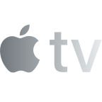 | Apple TV | [Apple_TV.png](icons/Apple_TV.png) | 144 × 144 |
| 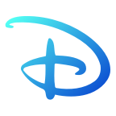 | Disney+ | [Disney.png](icons/Disney.png) | 144 × 144 |
| 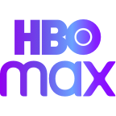 | HBO Max | [HBO_Max.png](icons/HBO_Max.png) | 144 × 144 |
|  | Netflix | [Netflix.png](icons/Netflix.png) | 144 × 144 |
|  | Spotify | [Spotify.png](icons/Spotify.png) | 144 × 144 |
|  | TikTok | [TikTok.png](icons/TikTok.png) | 144 × 144 |
|  | PayPal | [PayPal.png](icons/PayPal.png) | 144 × 144 |
| 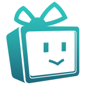 | 巴哈姆特 | [Bahamut.png](icons/Bahamut.png) | 144 × 144 |

## 国家与地区图标

| 预览 | 地区 | 文件 | 尺寸（px） |
| --- | --- | --- | --- |
|  | 美国 US | [United_States.png](icons/United_States.png) | 144 × 144 |
| 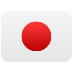 | 日本 JP | [Japan.png](icons/Japan.png) | 144 × 144 |
|  | 新加坡 SG | [Singapore.png](icons/Singapore.png) | 144 × 144 |
| 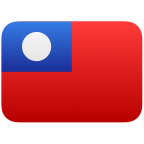 | 台湾 TW | [Taiwan.png](icons/Taiwan.png) | 144 × 144 |
|  | 香港 HK | [Hong_Kong.png](icons/Hong_Kong.png) | 144 × 144 |
| 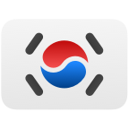 | 韩国 KR | [Korea.png](icons/Korea.png) | 144 × 144 |
|  | 欧洲 EU | [EU.png](icons/EU.png) | 144 × 144 |

## 通用代理图标

| 预览 | 用途 | 文件 | 尺寸（px） |
| --- | --- | --- | --- |
|  | 所有节点 / 地球 | [Global.png](icons/Global.png) | 144 × 144 |
|  | 代理 / Proxy | [Proxy.png](icons/Proxy.png) | 144 × 144 |
| 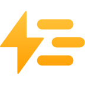 | 自动选择 / Auto | [Auto.png](icons/Auto.png) | 144 × 144 |
|  | 直连 / DIRECT | [Direct.png](icons/Direct.png) | 144 × 144 |
|  | 断开 / REJECT | [Reject.png](icons/Reject.png) | 144 × 144 |
| 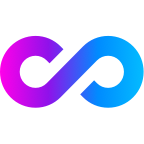 | 漏网之鱼 / Final | [Final.png](icons/Final.png) | 144 × 144 |
|  | 广告拦截 | [Advertising.png](icons/Advertising.png) | 144 × 144 |

## 其他备用版本

| 预览 | 用途 | 文件 | 尺寸（px） |
| --- | --- | --- | --- |
| 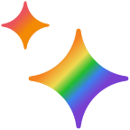 | AI · Qure 原版 | [AI.png](icons/AI.png) | 144 × 144 |
|  | Google · Qure 原版 | [Google.png](icons/Google.png) | 144 × 144 |
|  | Anthropic · 原版白底 | [Anthropic.png](icons/Anthropic.png) | 256 × 256 |
| 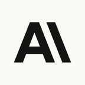 | Anthropic · 白底 QX 版 | [Anthropic-QX.png](icons/Anthropic-QX.png) | 144 × 144 |
| 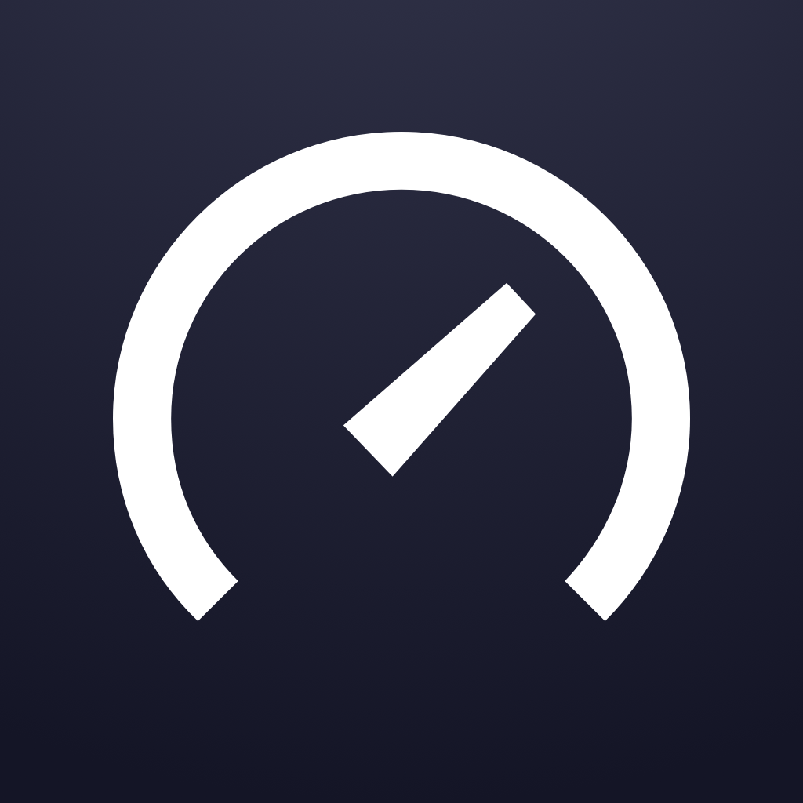 | Speedtest · 原版 | [Speedtest-HD.png](icons/Speedtest-HD.png) | 1024 × 1024 |
|  | Speedtest · 原版 QX | [Speedtest-QX.png](icons/Speedtest-QX.png) | 144 × 144 |
| 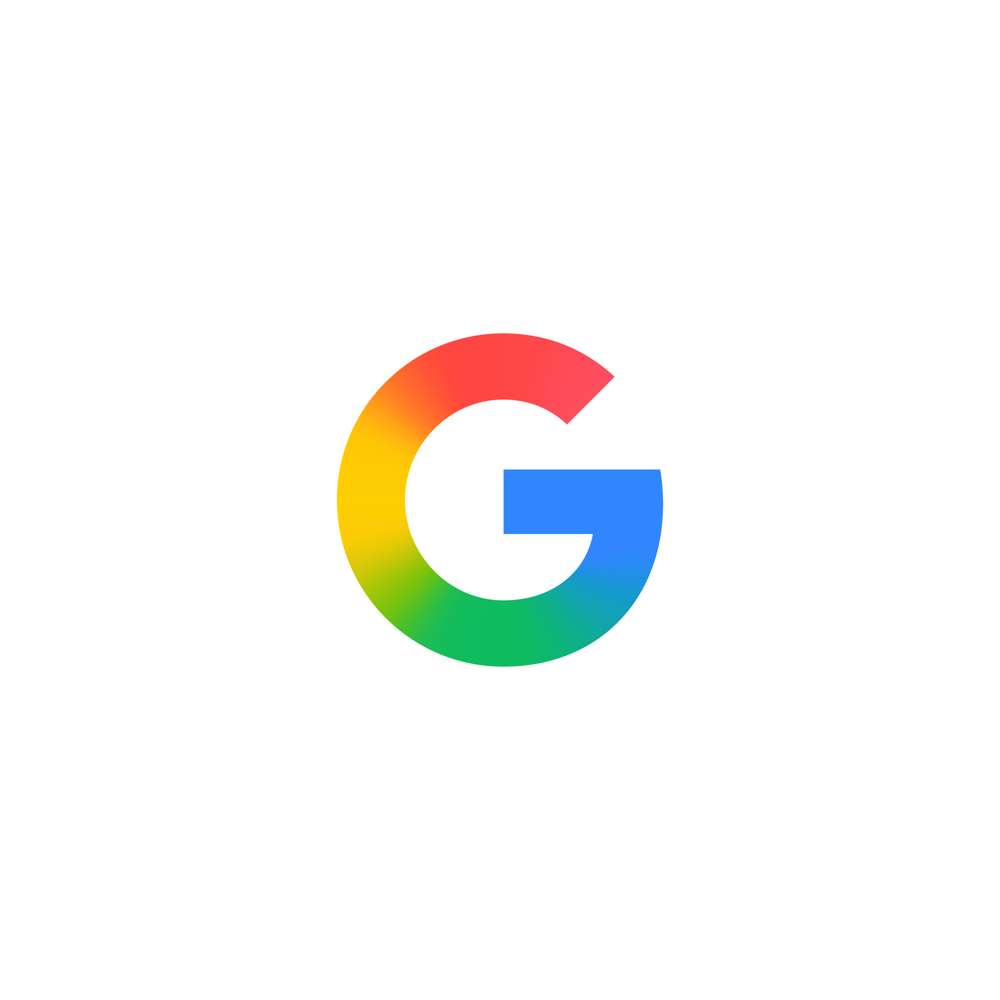 | Google · 官方原图（含留白） | [Google-G-Original.png](icons/Google-G-Original.png) | 2820 × 2820 |

## 矢量源文件

| 用途 | 文件 | 说明 |
| --- | --- | --- |
| 微软 · 官方四彩标志 | [Microsoft-Symbol.svg](icons/Microsoft-Symbol.svg) | Microsoft Learn 官方 SVG，原样保存 |
| Anthropic · 官方标志 | [Anthropic-Symbol-Slate.svg](icons/Anthropic-Symbol-Slate.svg) | Anthropic 官方媒体包，原样保存 |
| Anthropic · 暖棕圆角底 | [Anthropic-Tan.svg](icons/Anthropic-Tan.svg) | 官方标志配自定义暖棕底，用于独立渲染两套 PNG |

## 图片链接与文件说明

| 项目 | 说明 |
| --- | --- |
| 跟随仓库最新版本 | `https://raw.githubusercontent.com/Yoke1986/clash-icons/main/icons/文件名.png` |
| 固定图片版本 | `https://raw.githubusercontent.com/Yoke1986/clash-icons/提交SHA/icons/文件名.png` |
| 规格选择 | 已有 QX 专用版时使用 `-QX.png`；Clash 使用表中的原图或 `-HD.png`。Steam 等通用图标两端共用。 |
| 文件数量 | 52 个图像文件：49 张 PNG、3 份 SVG。 |
| 逐文件来源与校验 | [sources.json](sources.json)：来源地址、实际尺寸、文件大小、SHA-256。 |
| 出处与品牌权利 | [NOTICE.md](NOTICE.md) |
